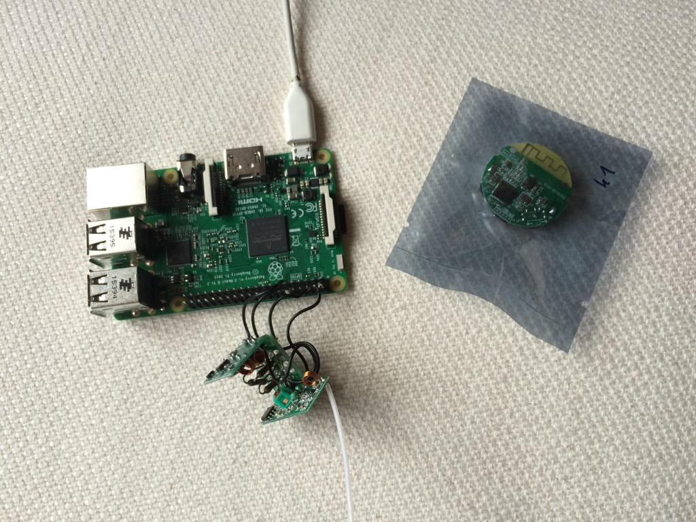
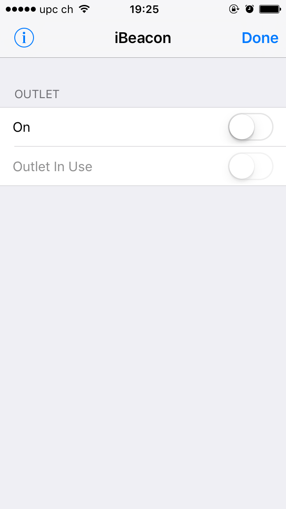

# beacon-discover

Check if the given iBeacon is in range. Fake a HomeKit outlet that is plugged in when the iBeacon is in reach. Allows you to setup rules like: "When iBeacon discovered unlock the door."

Program needs to be run as root, tested on Raspberry PI 3.






## TODO
- [ ] Whats a good scan interval, how often do beacons send.
- [ ] why does it not take my UUID?
- [ ] how to check minor and major 
- [X] heartbeat for iBeacon
- [X] interface to HomeKit
- [ ] add a fix for wellcore manufacturer data

## Wellcore iBeacon
Had an [issue with paypal/gatt](https://github.com/paypal/gatt/issues/74) not handling the scan response of the iBeaon.
UUID: E2C56DB5-DFFB-48D2-B060-D0F5A71096E0
Major: 1
Minor: 0
```
[2 1 0 0 81 120 104 243 123 152 30 2 1 6 26 255 76 0 2 21 226 197 109 181 223 251 72 210 176 96 208 245 167 16 150 224 0 1 0 0 197 187]
[2 1 4 0 81 120 104 243 123 152 16 2 10 0 4 22 83 81 67 7 255 0 0 0 84 0 0 186]
```


## Notes
* https://github.com/mlwelles/BeaconScanner#how-it-works
* [Gatt](https://github.com/paypal/gatt)
