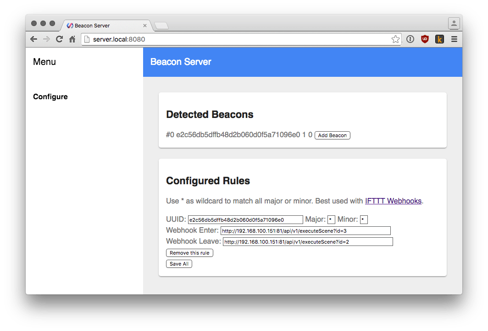

# Beacon Server
Checks if the given iBeacon is in range. Calls webhooks (eg IFTTT) when a beacon enters or leaves the area. Tested with Raspberry Pi 3 and OS X. [Download](https://github.com/yene/beacon-server/releases/latest)



## macOS
On macOS the interval in which beacons are reported is weird, I have seen up to 25 seconds.
You can change it by adding `-interval 25`.

## TODO
- [ ] add test for the wellcore beacon to [Gatt](https://github.com/yene/gatt)
- [ ] research for what the byte was (read their SDK)
- [ ] add stylish polymer buttons and cleanup ui
- [ ] form validate
- [ ] fix data races
- [X] refresh beacon list

## Wellcore iBeacon
Had an [issue with paypal/gatt](https://github.com/paypal/gatt/issues/74) not handling multiple adv data from iBeaconE2C56DB5-DFFB-48D2-B060-D0F5A71096E0.
```
[2 1 0 0 81 120 104 243 123 152 30 2 1 6 26 255 76 0 2 21 226 197 109 181 223 251 72 210 176 96 208 245 167 16 150 224 0 1 0 0 197 187]
[2 1 4 0 81 120 104 243 123 152 16 2 10 0 4 22 83 81 67 7 255 0 0 0 84 0 0 186]
```


## How to Build
Install dependencies:
```bash
go get github.com/jteeuwen/go-bindata/...
go get github.com/elazarl/go-bindata-assetfs/...
```

generate assets:
```bash
sh ./build-assets.sh
```

compile go with version:
```bash
go build -ldflags "-X main.version=v0.9.2"
```

## License
[MIT](https://tldrlegal.com/license/mit-license)


